___
# Máquina Editorial (HTB)

**IP atacante: 10.10.17.214**
**IP víctima: 10.129.59.177**

Comprobamos conexión con la máquina

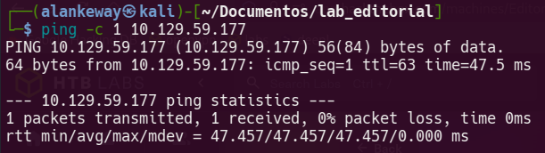

TTL = 63 -> Máquina Linux

___

# Reconocimiento activo y enumeración de puertos

Realizamos un nmap a la IP de la máquina víctima para enumerar posibles puertos abiertos.

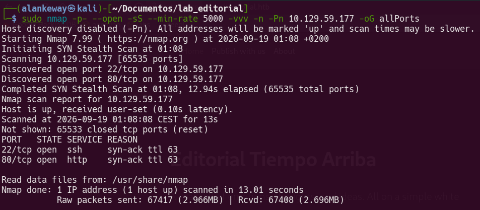

Puertos abiertos:
- 22 SSH
- 80 HTTP

Para ver las versiones y aplicar scripts básicos para dichos puertos lanzamos otro escaneo

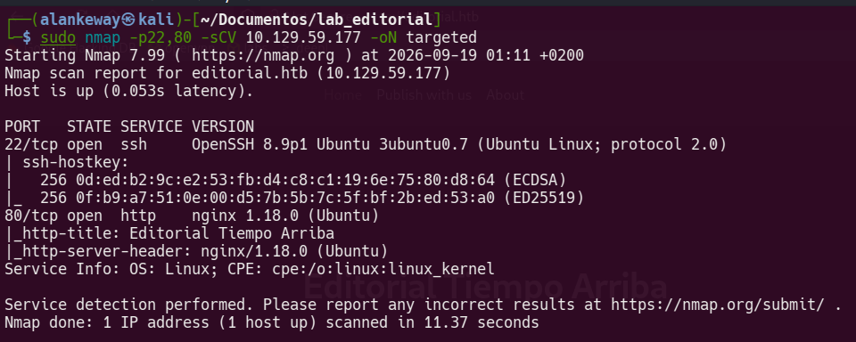

Al entrar a la web, vemos una página de una editorial de libros, tiene un apartado para subir un libro y una vista previa, por lo que nos aprovechamos de esto para aplicar un SSRF (Server Side Request Forgery)

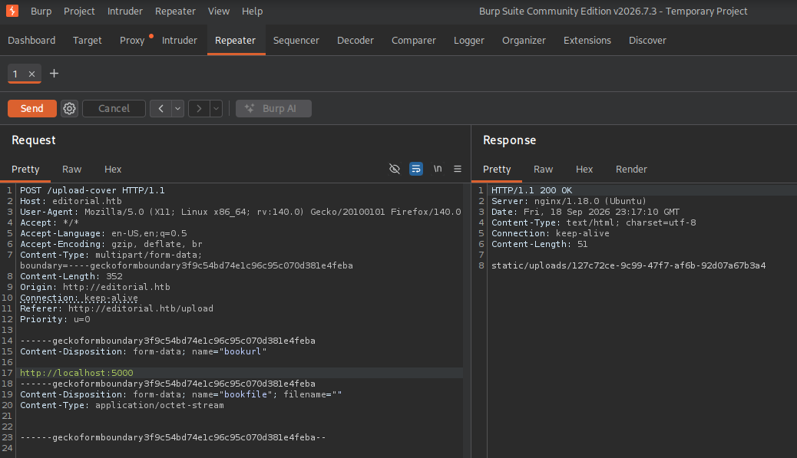

Previamente hemos realizado un ataque tipo `Sniper` para enumerar los puertos y el 5000 es el que muestra una respuesta diferente, asi que copiamos la ruta que muestra en la respuesta para ver que hay

Nos descarga un archivo

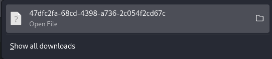

Mostramos su contenido y podemos ver información sobre la API y sus endpoints

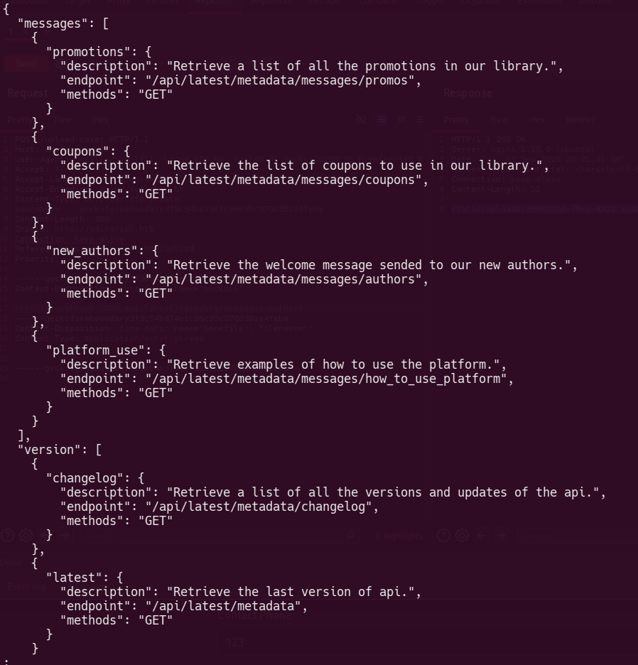

El que llama la atención es el mensaje de bienvenida a los autores, asi que volvemos a tramitar una petición interna agregando la ruta expuesta

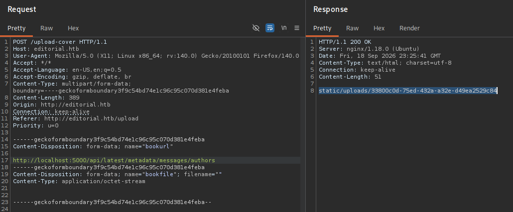

Nos dirigimos a esa ruta vía URL y nos descarga otro archivo


Miramos su contenido y vemos credenciales

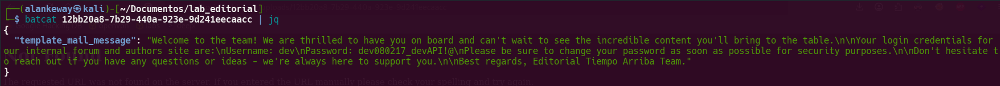

`dev:dev080217_devAPI!@`

Nos conectamos con el usuario dev por SSH y así obtenemos la flag del usuario

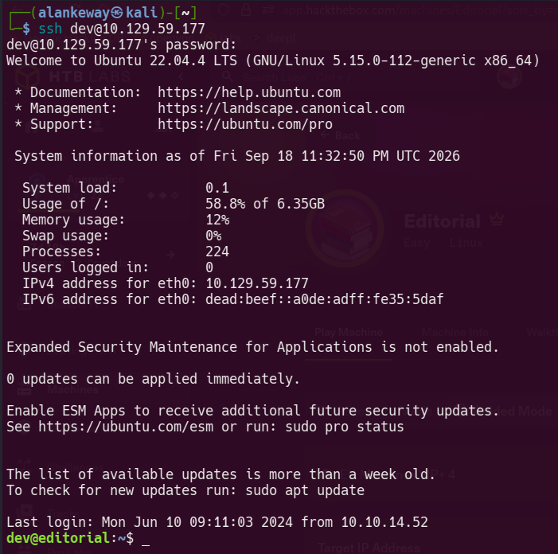

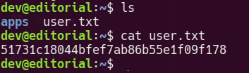

Dentro del directorio apps, encontramos un `.git`, asi que podemos ver los logs del repositorio para ver si encontramos más cosas

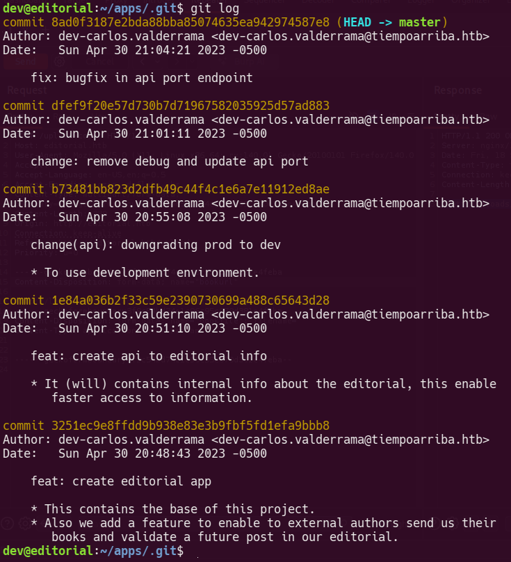

Miramos los cambios realizados en el tercer log

```bash
git log -p <n>
```

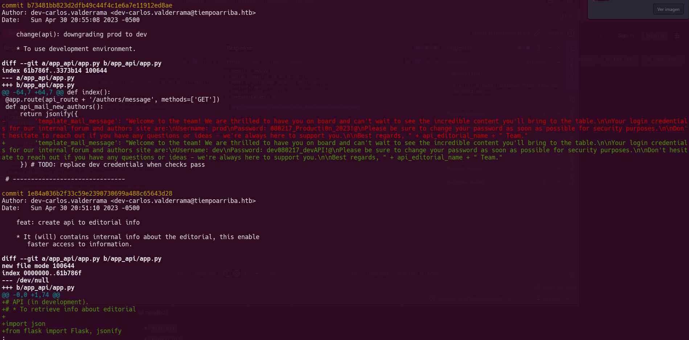

Encontramos las credenciales del usuario `prod`, asi que nos conectamos por ssh

Miramos qué puede ejecutar a nivel de sudoers

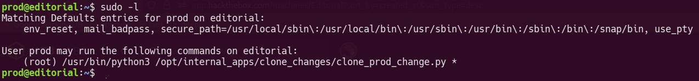

Puede ejecutar el script `clone_prod_change.py`, pero no puede modificarlo. El contenido es el siguiente:

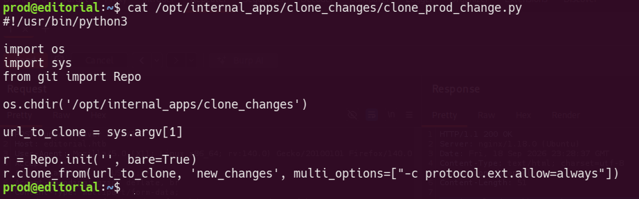

Dado a que el script clona un repositorio que le pasemos como argumentos, podemos inyectar el siguiente payload:

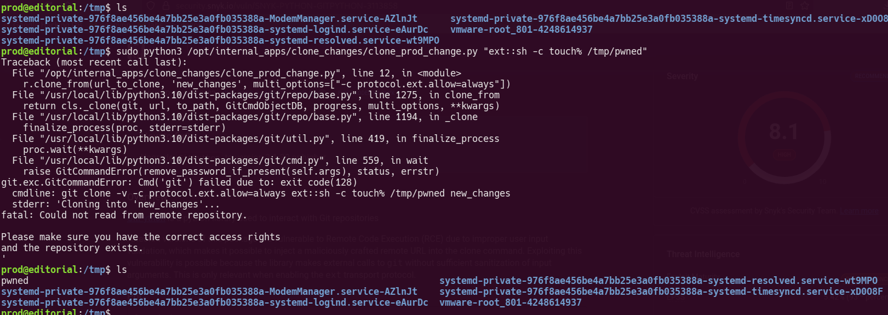

Ahora creamos un archivo que agregue el binario SUID a la bash y cambiamos el payload para que lo ejecute

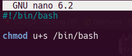

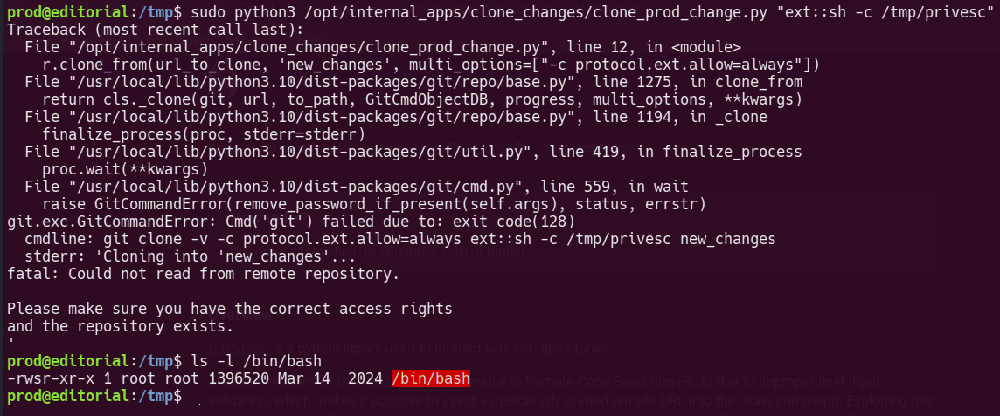

Lanzamos una bash con privilegios y miramos la flag del usuario

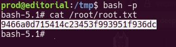
